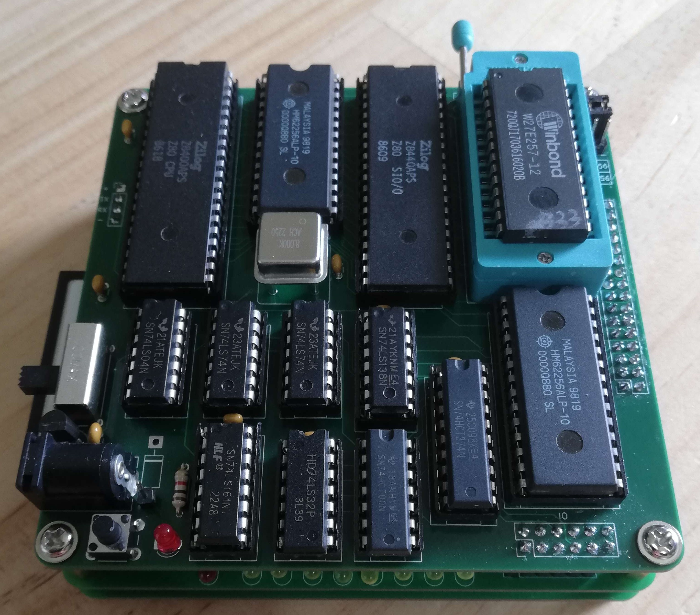
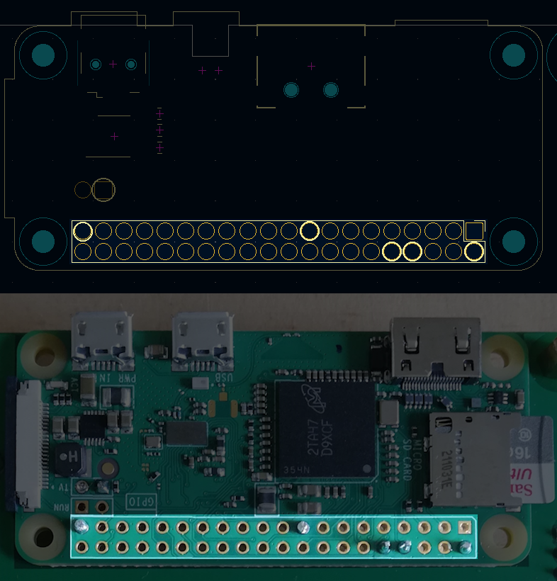
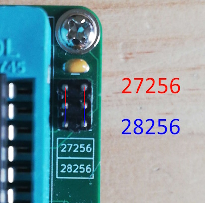
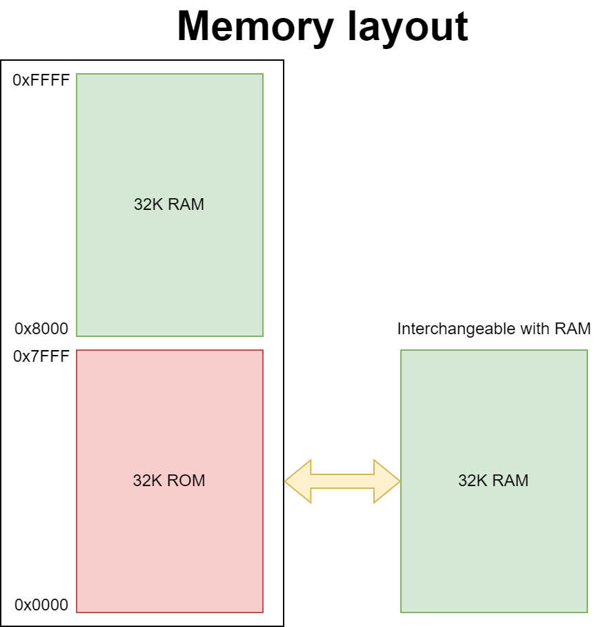

# Simple Z80 Computer
The goal of this project was to build a minimally complex Z80 computer capable of running CP/M. While I haven not yet ported CP/M, it should be capable of it.

This system is made of two boards, the upper board has the the CPU, RAM, ROM and UART. The lower board has Composite Video, USB Keyboard, USB to serial converter, Compact Flash and 8 indicator LEDs.

If you want to have a better understanding of how this system works you checkout the schematics or my [blog](https://blog.tephra.me/z80_sbc/).

## Specifications ##
* 64K Static RAM
* 32K ROM
* Z80 @ 4Mhz
* USB Keyboard via Raspberry Pi Zero
* Composite Video via Raspberry Pi Zero
* HDMI Video via Raspberry Pi Zero
* Support for 27256 or AT28C256 ROM
* Compact Flash
* 8 LED indicators
* Built in USB to serial converter @ 9600 baud

## Raspberry Pi Zero (Optional) ##
As part of the project I wanted to have a composite video output however there was not sufficient space to have a native composite video interface. As an alternative I have used a Raspberry Pi Zero running [pigfx](https://github.com/fbergama/pigfx) which acts as a terminal emulator providing a USB keyboard input and composite video output.

### Raspberry Pi Installation ###
To the under side of the PCB solder in the Raspberry Pi using the pins from a 2.54mm header so that the Pi is flat against the PCB. Only the circles and yellow need to be soldered. Back on the top side of the PCB you will see some pads the need to be connected to some test points on the Pi, connect them using some wire off cuts.

## ROM Jumper Configuration ##

This system supports the W27C257, 27256 and AT28C256 ROM chips. The W27C257, 27256 are read only and need to have to jumpers set in the top most position. The AT28C256 is read/write and need two jumpers in the lower position.

## Software Compiler ##
My assembler of choice for this project has been the [Retro Assembler](https://enginedesigns.net/retroassembler/) by Peter Tihanyi. There is a VSCode [plugin](https://marketplace.visualstudio.com/items?itemName=EngineDesigns.retroassembler) available.

## Memory Address Space ##

This system has 64K of RAM and 32K of ROM. However, the Z80 can only ever address 64K at a time. When the system starts up the top 32K of memory maps to RAM, and the lower 32K maps to ROM. The system can, when ready, swap the lower 32K of ROM for RAM.

 ## IO Address Space ##

| Address | Device        | R/W | Description             |
|---------|---------------|-----|-------------------------|
| 0x10    | SIO           | R/W | UART A Data Register    |
| 0x11    | SIO           | R   | UART A Status Register  |
| 0x12    | SIO           | R/W | UART B Data Register    |
| 0x13    | SIO           | R   | UART B Status Register  |
| 0x20    | 8-bit Latch   | W   | LED Output              |
| 0x30-37 | Compact Flash | R/W | Compact Flash Registers |
| 0x70    | Flip-flop     | W   | RAM/ROM Page            |

## Schematics ##

### Z80 Main Board Schematics - [PDF](design_files/main_board/simple_Z80.pdf) ###

### Compact Flash & Raspberry Pi Board - [PDF](design_files/CompactFlash/CompactFlash.pdf) ###

## BOM ##

### Z80 Board ##

| Id | Designator                                              | Footprint                                                          | Quantity | Designation         | Supplier and ref |   |   |
|----|---------------------------------------------------------|--------------------------------------------------------------------|----------|---------------------|------------------|---|---|
| 1  | J2                                                      | PinHeader_1x04_P2.54mm_Vertical                                    | 1        | Conn_01x04_Male     |                  |   |   |
| 2  | C3,C2,C4,C5,C17,C12,C14,C6,C7,C16,C9,C13,C8,C10,C11,C15 | C_Disc_D3.0mm_W1.6mm_P2.50mm                                       | 16       | 0.1uf               |https://www.digikey.co.nz/en/products/detail/kemet/C320C104K5R5TA7303/3726160                  |   |   |
| 3  | R2,R1,R3,R4                                             | R_Axial_DIN0204_L3.6mm_D1.6mm_P7.62mm_Horizontal                   | 4        | 2k7                 |                  |   |   |
| 4  | R5                                                      | R_Axial_DIN0204_L3.6mm_D1.6mm_P7.62mm_Horizontal                   | 1        | 1k                  |                  |   |   |
| 5  | C1                                                      | C_Disc_D3.0mm_W1.6mm_P2.50mm                                       | 1        | 150pF               |https://www.digikey.co.nz/en/products/detail/vishay-beyschlag-draloric-bc-components/K151J15C0GF5TL2/286469                  |   |   |
| 6  | U1                                                      | DIP-40_W15.24mm_Socket                                             | 1        | Z80CPU              |                  |   |   |
| 7  | U7                                                      | DIP-40_W15.24mm                                                    | 1        | Z8440               |                  |   |   |
| 8  | U14, U2                                                 | DIP-28_W15.24mm                                                    | 1        | KM62256CLP          |                  |   |   |
| 9  | U13                                                     | DIP-20_W7.62mm_Socket                                              | 1        | 74LS374             |                  |   |   |
| 10 | U5                                                      | DIP-14_W7.62mm_Socket                                              | 1        | 74LS04              |                  |   |   |
| 11 | U9                                                      | DIP-16_W7.62mm_Socket                                              | 1        | 74LS161             |                  |   |   |
| 12 | U3                                                      | DIP_Socket-28_W11.9_W12.7_W15.24_W17.78_W18.5_3M_228-1277-00-0602J | 1        | 27256               |                  |   |   |
| 13 | X1                                                      | Oscillator_DIP-8                                                   | 1        | CXO_DIP8            |https://www.digikey.co.nz/en/products/detail/abracon-llc/ACH-8-000MHZ-EK/675379                  |   |   |
| 14 | U15                                                     | TO-92                                                              | 1        | DS1233              |https://www.digikey.co.nz/en/products/detail/analog-devices-inc-maxim-integrated/DS1233-5-T-R/1017808                  |   |   |
| 15 | D2                                                      | LED_D3.0mm                                                         | 1        | LED                 |                  |   |   |
| 16 | U11,U8                                                  | DIP-14_W7.62mm_Socket                                              | 2        | 74LS74              |                  |   |   |
| 17 | SW2                                                     | SW_THT_SK-12F17-G_7-0                                              | 1        | SW_SPDT             |https://www.digikey.co.nz/en/products/detail/c-k/SK-12F17-G-7/2747163                  |   |   |
| 18 | U4                                                      | DIP-14_W7.62mm_Socket                                              | 1        | 74LS00              |                  |   |   |
| 19 | SW1                                                     | SW_PUSH_6mm_H4.3mm                                                 | 1        | SW_Push             |https://www.digikey.co.nz/en/products/detail/cui-devices/TS02-66-70-BK-160-LCR-D/15634243                  |   |   |
| 20 | U6                                                      | DIP-16_W7.62mm_Socket                                              | 1        | 74LS138             |                  |   |   |
| 21 | J1                                                      | PinSocket_2x16_P2.54mm_Vertical                                    | 1        | Conn_01x32_Pin      |                  |   |   |
| 22 | J4                                                      | BarrelJack_CUI_PJ-037A                                             | 1        | Jack-DC             |https://www.digikey.co.nz/en/products/detail/cui-devices/PJ-037A/1644545                  |   |   |
| 23 | U12                                                     | DIP-14_W7.62mm_Socket                                              | 1        | 74LS32              |                  |   |   |
| 24 | J7                                                      | PinSocket_2x06_P2.54mm_Vertical                                    | 1        | Conn_01x12_Male     |                  |   |   |
| 25 | J3                                                      | PinHeader_2x03_P2.54mm_Vertical                                    | 1        | Conn_02x03_Odd_Even |                  |   |   |

### CompactFlash ##

| Id | Designator                      | Footprint                                             | Quantity | Designation       | Supplier and ref |   |   |
|----|---------------------------------|-------------------------------------------------------|----------|-------------------|------------------|---|---|
| 1  | R2                              | R_Axial_DIN0204_L3.6mm_D1.6mm_P7.62mm_Horizontal      | 1        | 100R              |                  |   |   |
| 2  | J2                              | PinHeader_2x06_P2.54mm_Vertical                       | 1        | Conn_01x12_Male   |                  |   |   |
| 3  | J7,J8                           | SolderWirePad_1x01_SMD_1x2mm                          | 2        | Conn_01x01_Pin    |                  |   |   |
| 4  | R8,R9,R7,R10                    | R_Axial_DIN0204_L3.6mm_D1.6mm_P7.62mm_Horizontal      | 4        | 10k               |                  |   |   |
| 5  | J5                              | SWITCHCRAFT_PJRAN1X1U04X                              | 1        | RCA_Video         |https://www.digikey.co.nz/en/products/detail/switchcraft-inc/PJRAN1X1U04X/969899                         |   |   |
| 6  | U1                              | CF-Card_101D-TAAB-R01                                 | 1        | Compact_Flash     |https://www.digikey.co.nz/en/products/detail/attend-technology/101D-TAAB-R01/17633884                    |   |   |
| 7  | U2                              | DIP-20_W7.62mm                                        | 1        | 74LS541           |                  |   |   |
| 8  | Q2,Q1                           | TO-92_Inline                                          | 2        | 2N7000            |https://www.digikey.co.nz/en/products/detail/diotec-semiconductor/2N7000/13164314                        |   |   |
| 9  | D2,D8,D6,D1,D4,D7,D5,D9,D3      | LED_D3.0mm_Horizontal_O1.27mm_Z2.0mm                  | 9        | LED               |                  |   |   |
| 10 | R1,R5,R6,R3,R4                  | R_Axial_DIN0204_L3.6mm_D1.6mm_P7.62mm_Horizontal      | 5        | 1K                |                  |   |   |
| 11 | U3                              | SOP-8_3.9x4.9mm_P1.27mm                               | 1        | CH340N            |https://vi.aliexpress.com/item/1005004980156804.html                                                     |   |   |
| 12 | R19,R20                         | R_0805_2012Metric                                     | 2        | 1k                |https://www.digikey.co.nz/en/products/detail/stackpole-electronics-inc/RNCP0805FTD1K00/2240229           |   |   |
| 13 | R14,R15,R18,R11,R13,R16,R17,R12 | R_Axial_DIN0204_L3.6mm_D1.6mm_P7.62mm_Horizontal      | 8        | 1k                |                  |   |   |
| 14 | J1                              | Raspberry_Pi_Zero_Socketed_THT_FaceDown_MountingHoles | 1        | Raspberry_Pi_Zero |                  |   |   |
| 15 | J4                              | PinSocket_2x16_P2.54mm_Vertical                       | 1        | Conn_01x32_Pin    |                  |   |   |
| 16 | J6                              | USB_Mini-B_Wuerth_65100516121_Horizontal              | 1        | USB_B_Micro       |https://www.digikey.co.nz/en/products/detail/amphenol-cs-commercial-products/GMSB0532112YEU/13683104     |   |   |
| 17 | J3                              | 629104190121                                          | 1        | USB_A             |https://www.digikey.co.nz/en/products/detail/w%C3%BCrth-elektronik/629104190121/6644275                  |   |   |
| 18 | J10                             | PinSocket_1x04_P2.54mm_Vertical                       | 1        | Conn_01x04_Pin    |                  |   |   |
| 19 | C1                              | C_Disc_D3.0mm_W1.6mm_P2.50mm                          | 1        | 100pF             |                  |   |   |
| 20 | C2                              | C_0805_2012Metric                                     | 1        | 100nF             |https://www.digikey.co.nz/en/products/detail/samsung-electro-mechanics/CL21B104KBCNNNC/3886661           |   |   |